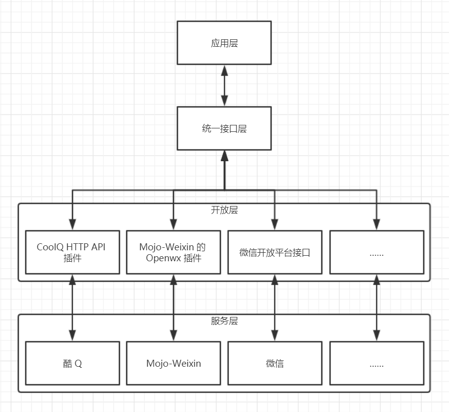

# 通用聊天机器人模型（UCB 模型）

通用聊天机器人模型，即 UCB 模型（Universal Chat Bot Model），将一个完整的聊天机器人结构划分为四层，以便于在不同层面上进行开发，以及不同层面之间的解耦。

目前还处在初步设计阶段。

## 理念

目前互联网上有非常多的即时聊天产品，有很多官方支持聊天机器人（例如 Telegram、微信公众号等），也有些不支持（例如 QQ、微信等），不支持的这些一般有第三方开发者对其进行一定的「破解」而提供一套机器人框架，而这些框架又有非常之多。

这就造成了一些混乱，假设有多个即时聊天平台需要接入，每个平台可以使用的机器人框架也有多种，如果直接在这些不同开发者设计的接口的基础上进行开发，将会非常繁琐，且耦合严重，一旦某个框架不再维护需要更换的时候，就会非常痛苦。

因此 UCB 模型的理念就是将整个聊天机器人的开发结构进行拆分，从而实现解耦，上层应用使用中间层封装好的接口时，也就不用关心下层的实现方式，因而可以下层可以任意更换而无需改变上层应用的代码，反之亦然。

## 四层模型

| 层次 | 名称 | 功能 |
| --- | ---- | --- |
| UCB Layer 4 | 应用层 Application Layer | 提供聊天机器人的实际业务逻辑或其它高抽象层次的框架，如 [XiaoKai Bot](https://github.com/CCZU-DEV/xiaokai-bot) |
| UCB Layer 3 | 接口层 Interface Layer | 提供统一的交互接口，包括事件的触发和功能的调用，如 [UCBI](UCBI.md) |
| UCB Layer 2 | 翻译层 Translation Layer | 在接口层和服务层之间进行协议的转换和翻译，如 [CoolQ HTTP API 插件](https://github.com/richardchien/coolq-http-api) 和 Mojo-Weixin 的 [Openwx 插件](https://metacpan.org/pod/distribution/Mojo-Weixin/lib/Mojo/Weixin.pod#Mojo::Weixin::Plugin::Openwx) |
| UCB Layer 1 | 服务层 Service Layer | 提供即时聊天账号的实际登录服务，或接入官方的机器人 SDK，如 [QQBot](https://github.com/pandolia/qqbot) 和 [酷 Q](https://cqp.cc/) |

## 图示

